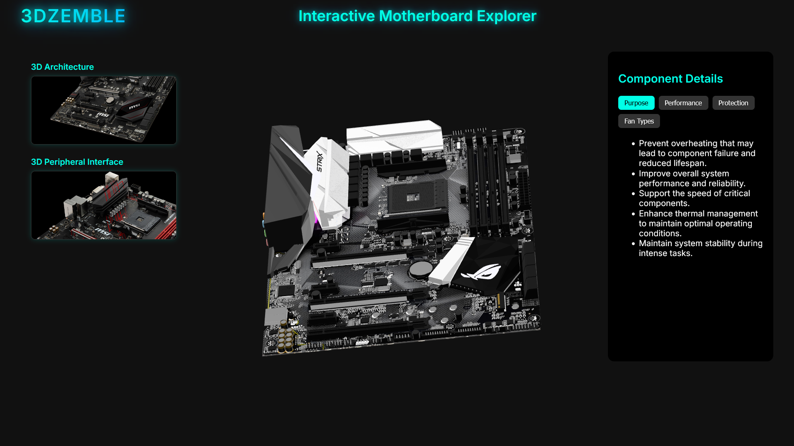
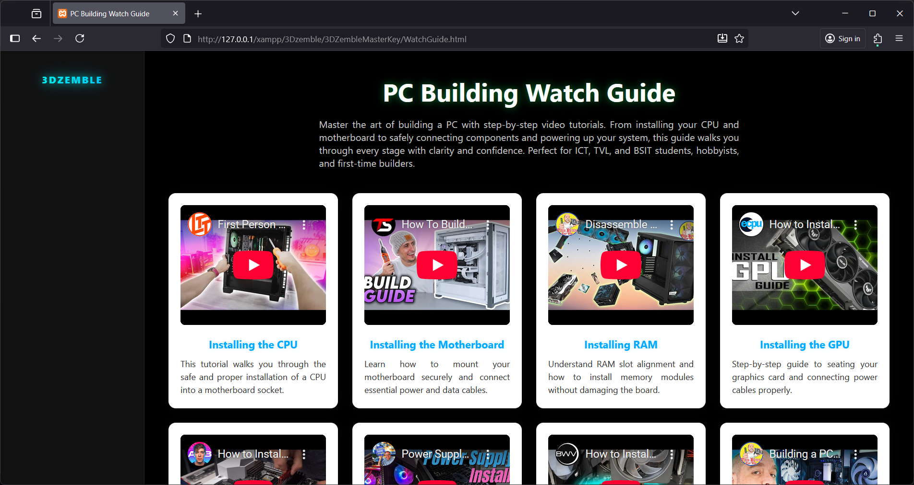
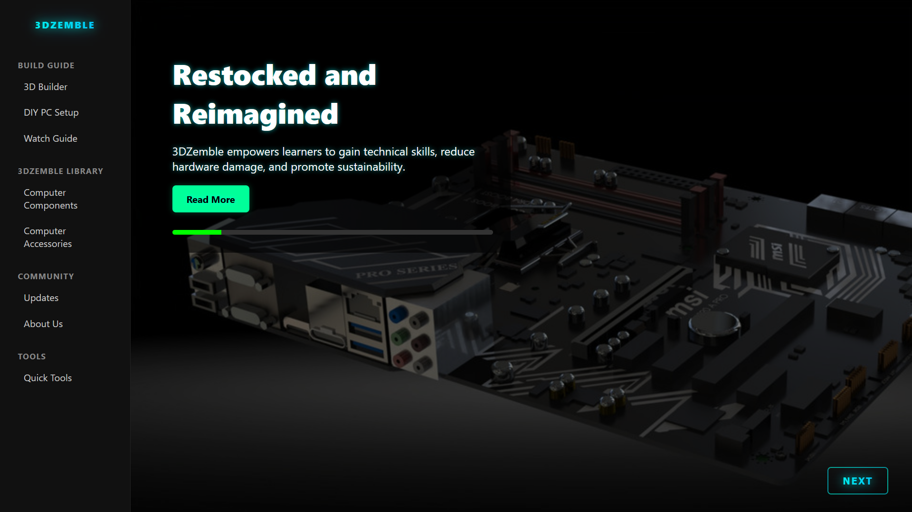
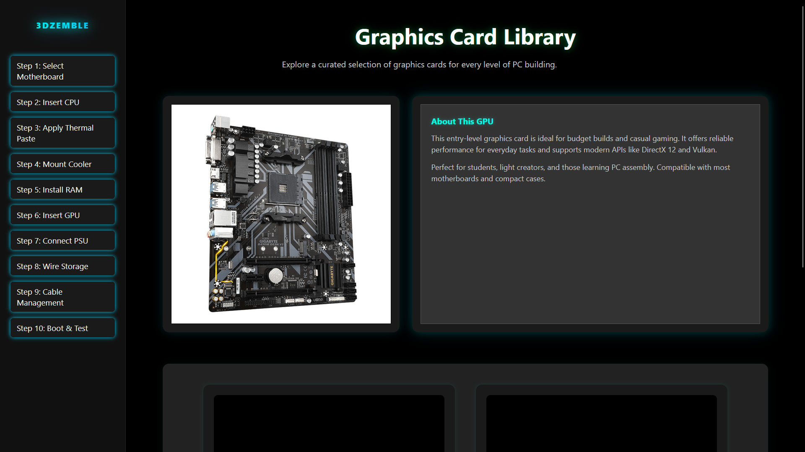
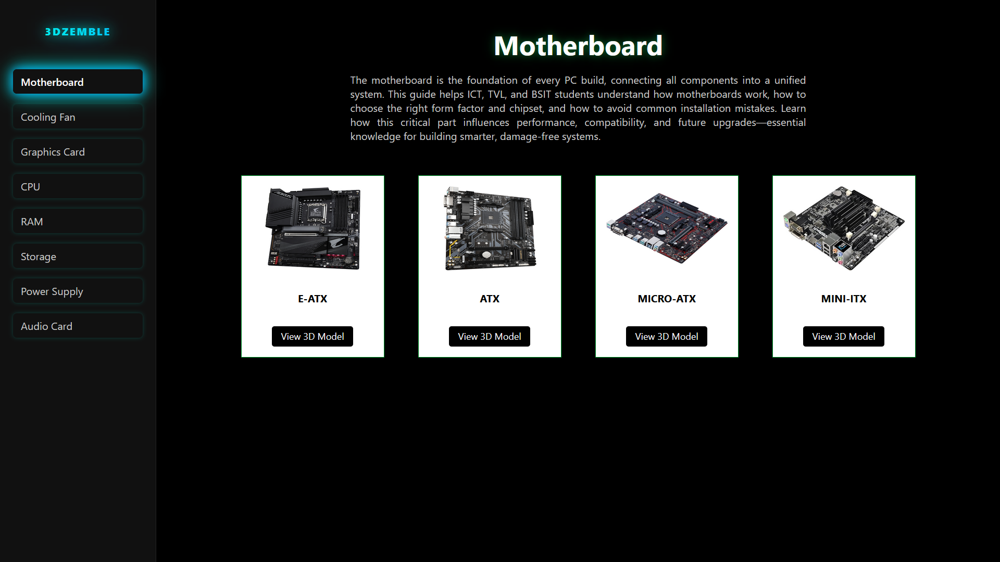
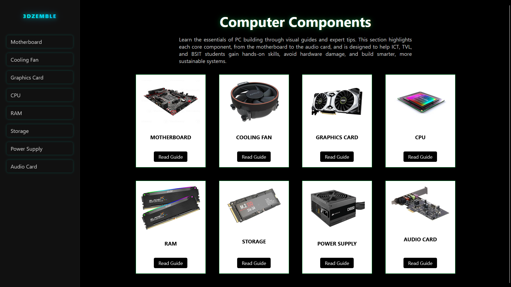
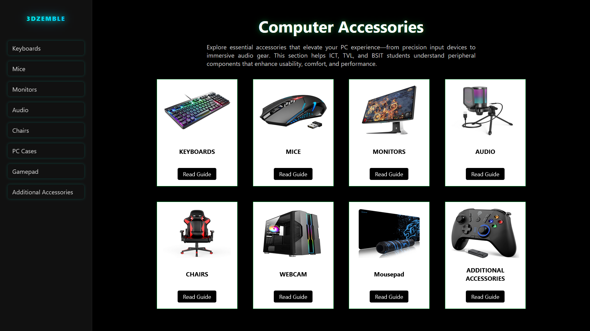

# Midterm Project: Interactive PC Builder

## Description / Overview
This project is an immersive educational platform designed to guide users through the process of building a personal computer from scratch. By integrating interactive 3D models, step-by-step tutorials, and visual feedback mechanisms, it transforms traditional PC assembly learning into a hands-on digital experience. Users can explore individual components, understand their functions, and follow a structured assembly sequence that mimics real-world practices. The system is ideal for ICT, TVL, and BSIT students who benefit from visual learning and want to gain practical knowledge in hardware setup, compatibility checks, and system integration.

## Objectives
- Understand the roles and functions of essential PC components
- Practice virtual assembly using guided steps and visual aids
- Strengthen technical documentation and Git workflow proficiency
- Ensure cross-browser compatibility and responsive design principles

## Features / Functionality

### 3D Model Viewer
Displays realistic 3D representations of PC components, allowing users to rotate, zoom, and inspect each part before assembly.  


### Video Guide
Embedded instructional videos walk users through each phase of the build process, from motherboard installation to cable management.  


### Sidebar Selection
A dynamic sidebar lets users choose components such as CPU, GPU, RAM, and storage. Each selection triggers visual feedback and highlights compatibility.  


### Step-by-Step Guide
The system provides a structured sequence of assembly steps, ensuring users follow the correct order and avoid common mistakes.  


### Components and Accessories Overview
Detailed visual breakdown of all available components and accessories:

- **Core Components**  
  This section includes the motherboard, processor, RAM, graphics card, and power supply. Each item is explained with its function and placement in the build.  
  

- **Peripheral Accessories**  
  Covers items like cooling fans, casing, and cable kits. Users learn how these accessories enhance performance and maintain system stability.  
  

- **Storage and Expansion**  
  Includes SSDs, HDDs, and expansion cards. The guide explains how to install and configure these for optimal performance.  
  

## Contributors
**Leymark Mendoza Ibay**

## Installation Instructions
### Start Code
<!DOCTYPE html>
<html lang="en">
<head>
  <meta charset="UTF-8" />
  <meta name="viewport" content="width=device-width, initial-scale=1.0"/>
  <title>Build Your Dream PC</title>
  <style>
    * { margin: 0; padding: 0; box-sizing: border-box; }
    html, body {
      height: 100%;
      font-family: 'Segoe UI', sans-serif;
      color: white;
    }
    .video-bg {
      position: fixed;
      top: 0; left: 0;
      width: 100vw; height: 100vh;
      object-fit: cover;
      z-index: -1;
      filter: brightness(1.1) contrast(1.2) saturate(1.2);
      pointer-events: none;
    }
    .overlay {
      position: relative;
      padding: 50px 20px;
      text-align: center;
      background: linear-gradient(to bottom, rgba(0,0,0,0.4), rgba(0,0,0,0.7));
      min-height: 100vh;
    }
    h1 {
      font-size: 2.5rem;
      color: #00e0d1;
      text-shadow: 0 0 6px rgba(0,224,209,0.4), 0 0 12px rgba(0,224,209,0.3);
    }
    h2 {
      font-size: 1.8rem;
      color: #ffcc00;
      text-shadow: 0 0 4px rgba(255,204,0,0.3), 0 0 8px rgba(255,204,0,0.2);
    }
    p {
      font-size: 1.2rem;
      color: #ddd;
      text-shadow: 0 0 2px rgba(0,0,0,0.5);
      margin-bottom: 40px;
    }
    .quick-start {
      display: flex;
      justify-content: center;
      gap: 20px;
      flex-wrap: wrap;
      margin-bottom: 40px;
    }
    .box {
      width: 250px;
      background: rgba(255,255,255,0.1);
      border-radius: 12px;
      overflow: hidden;
      display: flex;
      flex-direction: column;
      transition: transform 0.4s ease;
    }
    .box:hover {
      transform: translateY(-15px);
    }
    .zoom-wrapper {
      cursor: pointer;
    }
    .zoom-wrapper.animate {
      animation: zoomPulse 0.6s ease;
    }
    @keyframes zoomPulse {
      0% { transform: scale(1); }
      50% { transform: scale(1.2); }
      100% { transform: scale(1); }
    }
    .box img {
      width: 100%;
      height: auto;
      object-fit: cover;
      display: block;
    }
    .box p {
      padding: 15px;
      background-color: rgba(0,0,0,0.6);
    }
    .cta-button {
      background: #ff4081;
      border: none;
      padding: 15px 30px;
      font-size: 1.2rem;
      color: white;
      border-radius: 8px;
      text-decoration: none;
      transition: background 0.3s;
    }
    .cta-button:hover {
      background: #f50057;
    }
  </style>
</head>
<body>
  <video class="video-bg" autoplay muted loop>
    <source src="video/3Dzemble.webm" type="video/webm" />
    <source src="video/3Dzemble.mp4" type="video/mp4" />
    Your browser does not support the video tag.
  </video>
  <div class="overlay">
    <h1>3Dzemble</h1>
    <h2>Interactive PC Building in 3D</h2>
    <p>Featuring Compatibility Check, Price Comparison & 3D Models</p>
    <div class="quick-start">
      <div class="box">
        <div class="zoom-wrapper" data-link="float.html">
          
        </div>
        <p>All-AMD Red Build</p>
      </div>
      <div class="box">
        <div class="zoom-wrapper" data-link="builds/white-rgb.html">
          
        </div>
        <p>Baller White 4K RGB</p>
      </div>
      <div class="box">
        <div class="zoom-wrapper" data-link="builds/1440p.html">
          
        </div>
        <p>Modern 1440p Gaming</p>
      </div>
    </div>
    <a href="Home.html" class="cta-button">Start Building</a>
  </div>
  <script>
    document.querySelectorAll('.zoom-wrapper').forEach(wrapper => {
      wrapper.addEventListener('click', () => {
        wrapper.classList.add('animate');
        const link = wrapper.getAttribute('data-link');
        setTimeout(() => {
          wrapper.classList.remove('animate');
          setTimeout(() => {
            if (link) window.location.href = link;
          }, 300);
        }, 1200);
      });
    });
  </script>
</body>
</html>

### Home Code
<!DOCTYPE html>
<html lang="en">
<head>
  <meta charset="UTF-8" />
  <meta name="viewport" content="width=device-width, initial-scale=1.0"/>
  <title>3DZemble Home</title>
  <link rel="stylesheet" href="public/Home.css" />
</head>
<body>

  <!-- 🚀 Sidebar Navigation -->
  <nav class="sidebar">
    <h2><a href="Start.html" class="logo-link">3Dzemble</a></h2>

    <div class="sidebar-section">
      <h4>Build Guide</h4>
      <ul>
        <li><a href="3DBuild1.html">3D Builder</a></li>
        <li><a href="Prototype.html">DIY PC Setup</a></li>
        <li><a href="WatchGuide.html">Watch Guide</a></li>
      </ul>
    </div>

    <div class="sidebar-section">
      <h4>3DZemble Library</h4>
      <ul>
        <li><a href="ComputerComponents.html">Computer Components</a></li>
        <li><a href="ComputerAccessories.html">Computer Accessories</a></li>
      </ul>
    </div>

    <div class="sidebar-section">
      <h4>Community</h4>
      <ul>
        <li><a href="#updates">Updates</a></li>
        <li><a href="AboutUs.html">About Us</a></li>
      </ul>
    </div>

    <div class="sidebar-section">
      <h4>Tools</h4>
      <ul>
        <li><a href="#" id="quickToolsToggle">Quick Tools</a></li>
      </ul>
    </div>
  </nav>

  <!-- 🧲 Quick Tools Panel -->
  <div class="right-tools-wrapper">
    <div class="right-hover-zone"></div>
    <aside class="right-panel" id="rightPanel">
      <h3>Quick Tools</h3>
      <ul>
        <li><a href="#">Tips</a></li>
        <li><a href="#">Saved Builds</a></li>
        <li><a href="#">Benchmarks</a></li>
        <li><a href="Gaminggear.html">Gaming Gear</a></li>
        <li><a href="settings.html">Settings</a></li>
        <li><a href="Signup.html">Sign Up</a></li>
        <li><a href="#" id="fullscreenLink">Fullscreen Mode</a></li>
      </ul>
    </aside>
  </div>

  <!-- 🔁 Hero Slider -->
  <div class="slider-wrapper">
    <div class="slider" id="slider">
      <div class="section" style="background-image: url('picture/HomeBackground1.jpeg');">
        <div class="content">
          <div class="text">
            <h1>Restocked and Reimagined</h1>
            <p>3DZemble empowers learners to gain technical skills, reduce hardware damage, and promote sustainability.</p>
            <a href="#" class="cta-button">Read More</a>
            <div class="progress-bar-container"><div class="progress-bar"></div></div>
          </div>
        </div>
      </div>

      <div class="section" style="background-image: url('picture/HomeBackground2.jpeg');">
        <div class="content">
          <div class="text">
            <h1>Built for Hands-On Learning</h1>
            <p>Practice PC assembly safely and virtually—no risk, no waste.</p>
            <a href="#" class="cta-button">Explore</a>
            <div class="progress-bar-container"><div class="progress-bar"></div></div>
          </div>
        </div>
      </div>

      <div class="section" style="background-image: url('picture/HomeBackground3.jpeg');">
        <div class="content">
          <div class="text">
            <h1>What We Offer</h1>
            <p>Step-by-step 3D simulation, interactive component library, and immersive learning.</p>
            <a href="#" class="cta-button">Learn More</a>
            <div class="progress-bar-container"><div class="progress-bar"></div></div>
          </div>
        </div>
      </div>

      <div class="section" style="background-image: url('picture/Background3.webp');">
        <div class="content">
          <div class="text">
            <h1>Built for Education</h1>
            <p>Designed for ICT and BSIT students, bridging theory and hands-on experience.</p>
            <a href="#" class="cta-button">Discover</a>
            <div class="progress-bar-container"><div class="progress-bar"></div></div>
          </div>
        </div>
      </div>

      <div class="section" style="background-image: url('picture/Background4.jpg');">
        <div class="content">
          <div class="text">
            <h1>Future-Ready Learning</h1>
            <p>Backed by research and built with Blender and Three.js.</p>
            <a href="#" class="cta-button">Discover</a>
            <div class="progress-bar-container"><div class="progress-bar"></div></div>
          </div>
        </div>
      </div>
    </div>

    <!-- 🔘 Manual Slide Controls -->
    <div class="slider-controls">
      <button id="nextSlideBtn">Next</button>
    </div>
  </div>

  <!-- 📄 Static Section -->
  <section class="static-section" id="builder">
    <h2>Welcome to 3DZemble</h2>
    <p>This is where you can add more content below the hero slider—like features, specs, or product highlights.</p>
    <div class="features">
      <div class="feature-box">Custom Builds</div>
      <div class="feature-box">AI Optimization</div>
      <div class="feature-box">Visual Showcase</div>
    </div>
  </section>

  <!-- 📦 External JS -->
  <script src="public/js/Home.JS"></script>
</body>
</html>

### Acccessories Code
<!DOCTYPE html>
<html lang="en">
<head>
  <meta charset="UTF-8" />
  <meta name="viewport" content="width=device-width, initial-scale=1.0"/>
  <title>Computer Accessories</title>
  <link rel="stylesheet" href="public/ComputerAccessoriesMain.css" />
</head>
<body>

  <!-- 🚀 Sidebar (Left Side) -->
  <nav class="sidebar">
    <h2><a href="Home.html" class="logo-link">3Dzemble</a></h2>
    <ul>
      <li class="glow-item"><a href="Keyboards.html">Keyboards</a></li>
      <li class="glow-item"><a href="Mice.html">Mice</a></li>
      <li class="glow-item"><a href="Monitors.html">Monitors</a></li>
      <li class="glow-item"><a href="Audio.html">Audio</a></li>
      <li class="glow-item"><a href="Chairs.html">Chairs</a></li>
      <li class="glow-item"><a href="Cases.html">PC Cases</a></li>
      <li class="glow-item"><a href="Mousepad.html">Gamepad</a></li>
      <li class="glow-item"><a href="Accessories.html">Additional Accessories</a></li>
    </ul>
  </nav>

  <!-- 📚 Main Content -->
  <div class="container">
    <h1>Computer Accessories</h1>
    <p>Explore essential accessories that elevate your PC experience—from precision input devices to immersive audio gear.
      This section helps ICT, TVL, and BSIT students understand peripheral components that enhance usability, comfort, and performance.
    </p>

    <!-- 🧩 Gear Gallery -->
    <div class="gear-gallery">
      <div class="gear-item" style="--delay: 0.3s" id="keyboards">
        
        <h3>KEYBOARDS</h3>
        <a class="shop-btn" href="Keyboards.html">Read Guide</a>
      </div>

      <div class="gear-item" style="--delay: 0.5s" id="mice">
        
        <h3>MICE</h3>
        <a class="shop-btn" href="Mice.html">Read Guide</a>
      </div>

      <div class="gear-item" style="--delay: 0.7s" id="monitors">
        
        <h3>MONITORS</h3>
        <a class="shop-btn" href="Monitors.html">Read Guide</a>
      </div>

      <div class="gear-item" style="--delay: 0.9s" id="audio">
        
        <h3>AUDIO</h3>
        <a class="shop-btn" href="Audio.html">Read Guide</a>
      </div>

      <div class="gear-item" style="--delay: 1.1s" id="chairs">
        
        <h3>CHAIRS</h3>
        <a class="shop-btn" href="Chairs.html">Read Guide</a>
      </div>

      <div class="gear-item" style="--delay: 1.3s" id="webcam">
        
        <h3>WEBCAM</h3>
        <a class="shop-btn" href="Cases.html">Read Guide</a>
      </div>

      <div class="gear-item" style="--delay: 1.5s" id="gamepad">
        
        <h3>Mousepad</h3>
        <a class="shop-btn" href="Mousepad.html">Read Guide</a>
      </div>

      <div class="gear-item" style="--delay: 1.7s" id="extras">
        
        <h3>ADDITIONAL ACCESSORIES</h3>
        <a class="shop-btn" href="Extras.html">Read Guide</a>
      </div>
    </div>
  </div>

  <!-- ✅ Animation Trigger -->
  <script>
    window.addEventListener('DOMContentLoaded', () => {
      document.querySelectorAll('.gear-item').forEach(item => {
        item.classList.add('animate-in');
      });
    });
  </script>

</body>
</html>
To run the project locally:

```bash
git clone https://github.com/libay00722/Leymark.git
cd myapp4a
open index.html
